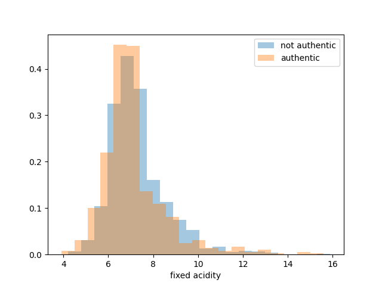
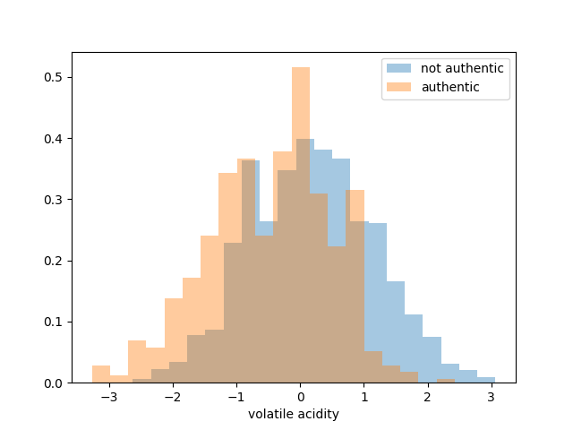
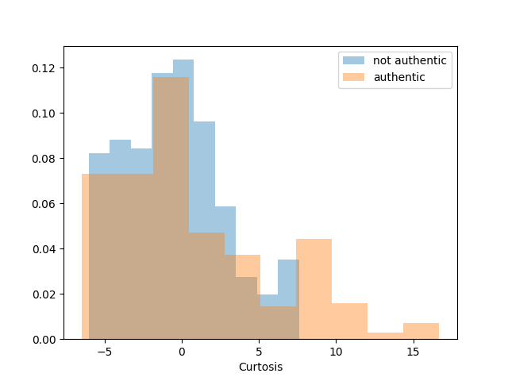
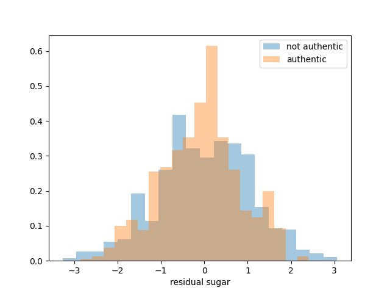
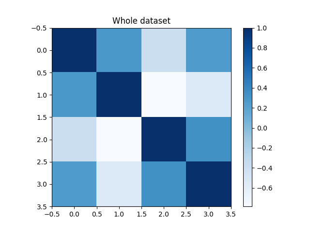
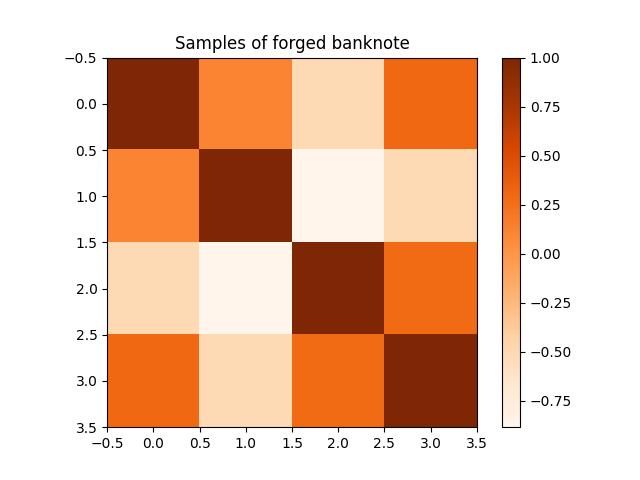

# Banknode authentication

## - Introduction

### Data Set Information:

Data were extracted from images that were taken from genuine and forged banknote-like specimens. For digitization, an industrial camera usually used for print inspection was used. The final images have 400x 400 pixels. Due to the object lens and distance to the investigated object gray-scale pictures with a resolution of about 660 dpi were gained. Wavelet Transform tool were used to extract features from images.

### Attribute Information:

1. variance of Wavelet Transformed image (continuous)
2. skewness of Wavelet Transformed image (continuous)
3. curtosis of Wavelet Transformed image (continuous)
4. entropy of image (continuous)
5. class (integer)

## - Features analysis

Plotting of the features:

Correlation between the features:

## - Classifier for the wine

# table MVG Classifiers min DCF
********************* MVG TABLE ************************************
------> pi = 0.5
*** minDCF - RAW FEATURES - NO PCA ***
[Single Fold] -  MVG:  0.34620265521280746
[5-Folds]  -  MVG:  0.3433931484502447
[Single Fold]  - MVG with Diag cov:  0.5275771183131589
[5- Fold] - MVG with Diag cov:  0.5481239804241436
[Single Fold] - Tied MVG:  0.35554959000390474
[5- Fold] - Tied MVG:  0.35970636215334423
[Single Fold] - Tied MVG with Diag Cov:  0.5214271768840297
[5 Fold] - Tied MVG with Diag Cov:  0.5432300163132138

*** minDCF - RAW FEATURES -  PCA (m=9) ***
[Single Fold] -  MVG:  0.4551810816087466
[5-Folds]  -  MVG:  0.49592169657422513
[Single Fold]  - MVG with Diag cov:  0.541207048028114
[5- Fold] - MVG with Diag cov:  0.5709624796084829
[Single Fold] - Tied MVG:  0.5556179226864506
[5- Fold] - Tied MVG:  0.35970636215334423
[Single Fold] - Tied MVG with Diag Cov:  0.5214271768840297
[5 Fold] - Tied MVG with Diag Cov:  0.5432300163132138

*** minDCF - RAW FEATURES -  PCA (m=8) ***
[Single Fold] -  MVG:  0.4909825263568918
[5-Folds]  -  MVG:  0.5375203915171289
[Single Fold]  - MVG with Diag cov:  0.6061108941819602
[5- Fold] - MVG with Diag cov:  0.6117455138662317
[Single Fold] - Tied MVG:  0.5850131784459196
[5- Fold] - Tied MVG:  0.35970636215334423
[Single Fold] - Tied MVG with Diag Cov:  0.5214271768840297
[5 Fold] - Tied MVG with Diag Cov:  0.5432300163132138

*** minDCF - GAUSSIANIZED FEATURES - NO PCA ***
[Single Fold] -  MVG:  0.27701581413510346
[5-Folds]  -  MVG:  0.3066884176182708
[Single Fold]  - MVG with Diag cov:  0.4976571651698555
[5- Fold] - MVG with Diag cov:  0.5163132137030996
[Single Fold] - Tied MVG:  0.3558180398281921
[5- Fold] - Tied MVG:  0.35970636215334423
[Single Fold] - Tied MVG with Diag Cov:  0.5214271768840297
[5 Fold] - Tied MVG with Diag Cov:  0.5432300163132138

*** minDCF - GAUSSIANIZED FEATURES -  PCA m=9 ***
[Single Fold] -  MVG:  0.3007858258492776
[5-Folds]  -  MVG:  0.3368678629690049
[Single Fold]  - MVG with Diag cov:  0.3921441819601718
[5- Fold] - MVG with Diag cov:  0.40783034257748774
[Single Fold] - Tied MVG:  0.42127098789535333
[5- Fold] - Tied MVG:  0.35970636215334423
[Single Fold] - Tied MVG with Diag Cov:  0.5214271768840297
[5 Fold] - Tied MVG with Diag Cov:  0.5432300163132138

*** minDCF - GAUSSIANIZED FEATURES -  PCA m=8 ***
[Single Fold] -  MVG:  0.34592200312377974
[5-Folds]  -  MVG:  0.38580750407830344
[Single Fold]  - MVG with Diag cov:  0.42793342444357674
[5- Fold] - MVG with Diag cov:  0.45840130505709625
[Single Fold] - Tied MVG:  0.4340955681374463
[5- Fold] - Tied MVG:  0.35970636215334423
[Single Fold] - Tied MVG with Diag Cov:  0.5214271768840297
[5 Fold] - Tied MVG with Diag Cov:  0.5432300163132138

------> pi = 0.9
*** minDCF - RAW FEATURES - NO PCA ***
[Single Fold] -  MVG:  0.8245314330339711
[5-Folds]  -  MVG:  0.9061990212071779
[Single Fold]  - MVG with Diag cov:  0.9375122022647404
[5- Fold] - MVG with Diag cov:  0.9730831973898859
[Single Fold] - Tied MVG:  0.8365384615384616
[5- Fold] - Tied MVG:  0.8278955954323002
[Single Fold] - Tied MVG with Diag Cov:  0.9831730769230769
[5 Fold] - Tied MVG with Diag Cov:  0.9526916802610115

*** minDCF - RAW FEATURES -  PCA (m=9) ***
[Single Fold] -  MVG:  0.8846275868801249
[5-Folds]  -  MVG:  0.9755301794453507
[Single Fold]  - MVG with Diag cov:  0.9471153846153845
[5- Fold] - MVG with Diag cov:  0.9885807504078302
[Single Fold] - Tied MVG:  0.9399160484185866
[5- Fold] - Tied MVG:  0.8278955954323002
[Single Fold] - Tied MVG with Diag Cov:  0.9831730769230769
[5 Fold] - Tied MVG with Diag Cov:  0.9526916802610115

*** minDCF - RAW FEATURES -  PCA (m=8) ***
[Single Fold] -  MVG:  0.9303250683326826
[5-Folds]  -  MVG:  0.9518760195758565
[Single Fold]  - MVG with Diag cov:  0.9663705583756346
[5- Fold] - MVG with Diag cov:  0.9632952691680261
[Single Fold] - Tied MVG:  0.9471153846153845
[5- Fold] - Tied MVG:  0.8278955954323002
[Single Fold] - Tied MVG with Diag Cov:  0.9831730769230769
[5 Fold] - Tied MVG with Diag Cov:  0.9526916802610115

*** minDCF - GAUSSIANIZED FEATURES - NO PCA ***
[Single Fold] -  MVG:  0.8245314330339711
[5-Folds]  -  MVG:  0.871125611745514
[Single Fold]  - MVG with Diag cov:  0.9639423076923077
[5- Fold] - MVG with Diag cov:  0.9755301794453507
[Single Fold] - Tied MVG:  0.9062988090589612
[5- Fold] - Tied MVG:  0.8278955954323002
[Single Fold] - Tied MVG with Diag Cov:  0.9831730769230769
[5 Fold] - Tied MVG with Diag Cov:  0.9526916802610115

*** minDCF - GAUSSIANIZED FEATURES -  PCA m=9 ***
[Single Fold] -  MVG:  0.8582584927762592
[5-Folds]  -  MVG:  0.898042414355628
[Single Fold]  - MVG with Diag cov:  0.8990750683326825
[5- Fold] - MVG with Diag cov:  0.8996737357259381
[Single Fold] - Tied MVG:  0.903882760640375
[5- Fold] - Tied MVG:  0.8278955954323002
[Single Fold] - Tied MVG with Diag Cov:  0.9831730769230769
[5 Fold] - Tied MVG with Diag Cov:  0.9526916802610115

*** minDCF - GAUSSIANIZED FEATURES -  PCA m=8 ***
[Single Fold] -  MVG:  0.8678738773916441
[5-Folds]  -  MVG:  0.8923327895595433
[Single Fold]  - MVG with Diag cov:  0.9278968176493556
[5- Fold] - MVG with Diag cov:  0.900489396411093
[Single Fold] - Tied MVG:  0.8534019914096056
[5- Fold] - Tied MVG:  0.8278955954323002
[Single Fold] - Tied MVG with Diag Cov:  0.9831730769230769
[5 Fold] - Tied MVG with Diag Cov:  0.9526916802610115

------> pi = 0.1
*** minDCF - RAW FEATURES - NO PCA ***
[Single Fold] -  MVG:  0.7667415072237407
[5-Folds]  -  MVG:  0.7952691680261011
[Single Fold]  - MVG with Diag cov:  0.9112895353377588
[5- Fold] - MVG with Diag cov:  0.9624796084828711
[Single Fold] - Tied MVG:  0.8188329754002344
[5- Fold] - Tied MVG:  0.8433931484502446
[Single Fold] - Tied MVG with Diag Cov:  0.913949629051152
[5 Fold] - Tied MVG with Diag Cov:  0.9706362153344209

*** minDCF - RAW FEATURES -  PCA (m=9) ***
[Single Fold] -  MVG:  0.9660410972276454
[5-Folds]  -  MVG:  0.9804241435562806
[Single Fold]  - MVG with Diag cov:  0.9633810035142523
[5- Fold] - MVG with Diag cov:  1.0
[Single Fold] - Tied MVG:  0.9746192893401016
[5- Fold] - Tied MVG:  0.8433931484502446
[Single Fold] - Tied MVG with Diag Cov:  0.913949629051152
[5 Fold] - Tied MVG with Diag Cov:  0.9706362153344209

*** minDCF - RAW FEATURES -  PCA (m=8) ***
[Single Fold] -  MVG:  0.9708731940648185
[5-Folds]  -  MVG:  0.99836867862969
[Single Fold]  - MVG with Diag cov:  0.9925078094494338
[5- Fold] - MVG with Diag cov:  1.0
[Single Fold] - Tied MVG:  0.963625048809059
[5- Fold] - Tied MVG:  0.8433931484502446
[Single Fold] - Tied MVG with Diag Cov:  0.913949629051152
[5 Fold] - Tied MVG with Diag Cov:  0.9706362153344209

*** minDCF - GAUSSIANIZED FEATURES - NO PCA ***
[Single Fold] -  MVG:  0.7918781725888325
[5-Folds]  -  MVG:  0.7724306688417617
[Single Fold]  - MVG with Diag cov:  0.901381296368606
[5- Fold] - MVG with Diag cov:  0.9274061990212071
[Single Fold] - Tied MVG:  0.8898989652479501
[5- Fold] - Tied MVG:  0.8433931484502446
[Single Fold] - Tied MVG with Diag Cov:  0.913949629051152
[5 Fold] - Tied MVG with Diag Cov:  0.9706362153344209

*** minDCF - GAUSSIANIZED FEATURES -  PCA m=9 ***
[Single Fold] -  MVG:  0.8206511128465444
[5-Folds]  -  MVG:  0.8050570962479608
[Single Fold]  - MVG with Diag cov:  0.8343054470909801
[5- Fold] - MVG with Diag cov:  0.8841761827079934
[Single Fold] - Tied MVG:  0.8978792463881297
[5- Fold] - Tied MVG:  0.8433931484502446
[Single Fold] - Tied MVG with Diag Cov:  0.913949629051152
[5 Fold] - Tied MVG with Diag Cov:  0.9706362153344209

*** minDCF - GAUSSIANIZED FEATURES -  PCA m=8 ***
[Single Fold] -  MVG:  0.8706803982819212
[5-Folds]  -  MVG:  0.932300163132137
[Single Fold]  - MVG with Diag cov:  0.9454924834049201
[5- Fold] - MVG with Diag cov:  0.9820554649265906
[Single Fold] - Tied MVG:  0.9874316673174541
[5- Fold] - Tied MVG:  0.8433931484502446
[Single Fold] - Tied MVG with Diag Cov:  0.913949629051152
[5 Fold] - Tied MVG with Diag Cov:  0.9706362153344209

++++++++++++++++++++++++++++++++++++++++++++++++++++++++++++++

********************* LG TABLE ************************************
------> pi = 0.5
*** minDCF - RAW FEATURES ***
[5-Folds]  -  lam = 10^-5, pi_T = 0.5:  0.5636215334420881
[5-Folds]  -  lam = 10^-5, pi_T = 0.1:  0.5783034257748776
[5-Folds]  -  lam = 10^-5, pi_T = 0.9:  0.5864600326264273

*** minDCF - GAUSSIANIZED FEATURES  ***
[5-Folds]  -  lam = 10^-5, pi_T = 0.5:  0.3719412724306689
[5-Folds]  -  lam = 10^-5, pi_T = 0.1:  0.3727569331158238
[5-Folds]  -  lam = 10^-5, pi_T = 0.9:  0.3752039151712887

------> pi = 0.1
*** minDCF - RAW FEATURES ***
[5-Folds]  -  lam = 10^-5, pi_T = 0.5:  0.9274061990212071
[5-Folds]  -  lam = 10^-5, pi_T = 0.1:  0.9469820554649265
[5-Folds]  -  lam = 10^-5, pi_T = 0.9:  0.9110929853181078

*** minDCF - GAUSSIANIZED FEATURES  ***
[5-Folds]  -  lam = 10^-5, pi_T = 0.5:  0.8197389885807504
[5-Folds]  -  lam = 10^-5, pi_T = 0.1:  0.9869494290375205
[5-Folds]  -  lam = 10^-5, pi_T = 0.9:  0.8287112561174552

------> pi = 0.9
*** minDCF - RAW FEATURES ***
[5-Folds]  -  lam = 10^-5, pi_T = 0.5:  0.9706362153344209
[5-Folds]  -  lam = 10^-5, pi_T = 0.1:  0.966557911908646
[5-Folds]  -  lam = 10^-5, pi_T = 0.9:  0.9796084828711256

*** minDCF - GAUSSIANIZED FEATURES  ***
[5-Folds]  -  lam = 10^-5, pi_T = 0.5:  0.8548123980424144
[5-Folds]  -  lam = 10^-5, pi_T = 0.1:  0.7911908646003263
[5-Folds]  -  lam = 10^-5, pi_T = 0.9:  0.9143556280587275

********************************************************************

## - Experimental validation

## - Conclusions