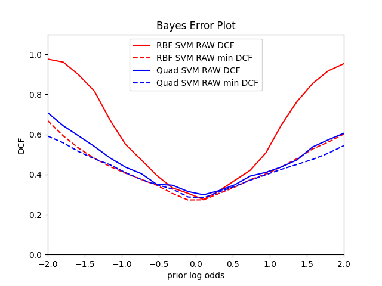

# Wine quality detection

## - Introduction

The dataset used for the purpose of this analysis is related to red and white variants of the Portuguese "Vinho Verde" wine and is taken from the UCI repository.

The dataset was collected to predict human wine taste preferences. As a matter of fact, it associates the physiochemical characteristics of the analyzed wine to sensory evaluations made by experts.

The original dataset consists of 10 classes (quality 1 to 10), but for this project the dataset has been binarized, collecting all wines with low quality (lower than 6) into class 0 and good quality (grater than 6) into class 0. Wines with quality 6 have been discarded to simplify the task.

The dataset contains both red and white wines that were originally separated, whereas in this analysis they have been merged.

The following analysis is aimed at exploring the characteristics of the chosen dataset to find the model that best classifies the input data. In order to fulfill this purpose, several classifiers combined with different preprocessing techniques have been exploited. The main results will be shown in this report.

### Classes balance:

The dataset has been divided into a training set and a test set.

The training set contains 613 samples belonging to the "high quality" class and 1226 belonging to the "low quality" class. On the other hand, the evaluation set contains 664 samples of class "high quality" and 1158 samples of class "low quality". Therefore, the classes are partially balanced.

The following graphs show the comparison between the number of samples of the two classes in both training and test data set. It emerges that both the number of samples and the ratio between the two classes in the different datasets is similar. 

|  |  |
| ------------------------------------------------------------ | ------------------------------------------------------------ |

### Attribute Information:

The input variables have 11 continuous features based on physiochemical tests:

0 - fixed acidity
1 - volatile acidity
2 - citric acid
3 - residual sugar
4 - chlorides
5 - free sulfur dioxide
6 - total sulfur dioxide
7 - density
8 - pH
9 - sulphates
10 - alcohol

The output variable is a discrete value representing the quality of the wine sample (0 low quality/1 high quality)

## - Preprocessing and Features analysis 

The features of the dataset refer to different types of variables and have therefore different measuring scales.

Thus, in order to compare similarities between features, the dataset has been z-normalized, through centering and scaling to unit variance the features. 

The histograms below show the distributions of the training dataset features. Orange histograms  refer to high quality wines, whereas blue histograms to low quality wines.

|  |  |  |
| :----------------------------------------------------------: | ------------------------------------------------------------ | ------------------------------------------------------------ |
|  |  |  |
|  |  |  |
|  |  |                                                              |

The analysis of the training data reveals that most of the features have an irregular distribution.

Consequently, the classification (especially of Gaussian based methods) may produce sub-optimal results.

We therefore further preprocessed our data by "Gaussianizing" the features.

The gaussianization process allows mapping the features values to ones whose empirical comulative distribution function is well approximated by a Gaussian c.d.f. To do so, the features have been mapped to a uniform distribution and then transformed  through the inverse of Gaussian cumulative distribution function.

The histograms below show the distributions of the gaussianized features.

|  |  |  |
| :----------------------------------------------------------: | ------------------------------------------------------------ | ------------------------------------------------------------ |
|  |  |  |
|  |  |  |
|  |  |                                                              |

A correlation analysis of the Gaussianized features shows that feature 5 and 6 are strongly correlated.

The heatmaps showing the Pearson correlation coefficient can be found below (****FORMULA********)

| All dataset |  |  |
| ------------------------------------------------------------ | ------------------------------------------------------------ | ------------------------------------------------------------ |

This suggests that the classification may benefit from using PCA to map data to 10 or 9 uncorrelated features to reduce the number of parameters to estimate. 

## - Classification of Wine Quality features

##### Methodologies used for validation:

In order to understand which model is most promising and to assess the effects of using PCA, both single fold-validation and K-Fold cross-validation have been adopted.

At first, a single fold approach has been used, since the training with this approach is faster. Indeed, single fold approach consists in splitting the training dataset into two subsets, one (66% of the original set) for development and the other one for validation. 

Subsequently, the K-Fold approach has been used to get more robust results. In this case, the training set are iteratively split into 5 folds, 4 used for training and 1 for validation, after being shuffled. The validation scores have been eventually put together and used to compute the performance metrics. In this way, there is more data available for training and validation. 

This document focuses on the analysis of the balanced uniform prior application:

​				(prior, Cfp, Cfn) = (0.5,1,1)

However, two other unbalanced applications have been considered:

​				(prior, Cfp, Cfn) = (0.9,1,1), (prior, Cfp, Cfn) = (0.1,1,1)

??Since the classes are partially unbalanced toward the low quality class, we expect to have better results in the application biased toward the low quality class (therefore with prior 0.1) rather than the other one.

In the fist part, the main aim of the analysis was to choose the most promising approach. Therefore, the performances have been measured in terms of normalized minimum detection costs, namely the costs that would be paid by making optimal decisions for the validation set through the use of recognizers scores.

## * MVG classifiers  
|                                        | **Single Fold** |             |             | **5-Fold**  |             |             |
| :------------------------------------: | --------------- | ----------- | ----------- | ----------- | ----------- | ----------- |
|                                        | prior=0.5       | prior=0.9   | prior=0.1   | prior=0.5   | prior=0.9   | prior=0.1   |
|       **Raw Features – no PCA**        | -------------   | ----------- | ----------- | ----------- | ----------- | ----------- |
|            ***Full - Cov***            | ***0.304***     | *0.812*     | *0.777*     | ***0.312*** | *0.842*     | *0.778*     |
|            ***Diag -Cov***             | *0.437*         | *0.875*     | *0.818*     | *0.420*     | *0.921*     | *0.845*     |
|          ***Tied Full-Cov***           | *0.334*         | *0.733*     | *0.779*     | *0.333*     | *0.748*     | *0.812*     |
|          ***Tied Diag- Cov***          | *0.412*         | *0.901*     | *0.832*     | *0.402*     | *0.932*     | *0.866*     |
|   **Gaussianized Features – no PCA**   | -----------     | ----------- | ----------- | ----------- | ----------- | ----------- |
|            ***Full - Cov***            | ***0.270***     | *0.740*     | *0.807*     | ***0.306*** | *0.790*     | *0.784*     |
|            ***Diag -Cov***             | *0.456*         | *0.848*     | *0.860*     | *0.448*     | *0.914*     | *0.834*     |
|          ***Tied Full-Cov***           | *0.348*         | *0.812*     | *0.867*     | *0.354*     | *0.884*     | *0.803*     |
|          ***Tied Diag- Cov***          | *0.451*         | *0.891*     | *0.839*     | *0.451*     | *0.942*     | *0.879*     |
|     **Raw Features – PCA (m=10)**      | -----------     | ----------- | ----------- | ----------- | ----------- | ----------- |
|             **Full - Cov**             | 0.325           | 0.814       | 0.772       | 0.321       | 0.854       | 0.797       |
|             **Diag -Cov**              | 0.375           | 0.899       | 0.821       | 0.397       | 0.924       | 0.812       |
|           **Tied Full-Cov**            | 0.341           | 0.697       | 0.806       | 0.333       | 0.760       | 0.823       |
|           **Tied Diag- Cov**           | 0.337           | 0.651       | 0.794       | 0.337       | 0.765       | 0.825       |
| **Gaussianized Features – PCA (m=10)** | -----------     | ----------- | ----------- | ----------- | ----------- | ----------- |
|            ***Full - Cov***            | *0.312*         | *0.817*     | *0.779*     | *0.328*     | *0.862*     | *0.807*     |
|            ***Diag -Cov***             | *0.362*         | *0.747*     | *0.780*     | *0.378*     | *0.824*     | *0.804*     |
|          ***Tied Full-Cov***           | *0.324*         | *0.682*     | *0.791*     | *0.328*     | *0.753*     | *0.809*     |
|          ***Tied Diag- Cov***          | *0.335*         | *0.656*     | *0.822*     | *0.334*     | *0.782*     | *0.822*     |
|      **Raw Features – PCA (m=9)**      | -----------     | ----------- | ----------- | ----------- | ----------- | ----------- |
|             **Full - Cov**             | 0.322           | 0.805       | 0.787       | 0.327       | 0.811       | 0.814       |
|             **Diag -Cov**              | 0.364           | 0.867       | 0.803       | 0.389       | 0.866       | 0.805       |
|           **Tied Full-Cov**            | 0.341           | 0.706       | 0.806       | 0.331       | 0.760       | 0.823       |
|           **Tied Diag- Cov**           | 0.343           | 0.658       | 0.799       | 0.338       | 0.765       | 0.830       |
| **Gaussianized Features – PCA (m=9)**  | -----------     | ----------- | ----------- | ----------- | ----------- | ----------- |
|            ***Full - Cov***            | *0.300*         | *0.817*     | *0.783*     | *0.319*     | *0.814*     | *0.800*     |
|            ***Diag -Cov***             | *0.349*         | *0.764*     | *0.810*     | *0.368*     | *0.814*     | *0.804*     |
|          ***Tied Full-Cov***           | *0.331*         | *0.677*     | *0.786*     | *0.327*     | *0.752*     | *0.816*     |
|          ***Tied Diag- Cov***          | *0.337*         | *0.673*     | *0.822*     | *0.335*     | *0.783*     | *0.825*     |
|      **Raw Features – PCA (m=8)**      | -----------     | ----------- | ----------- | ----------- | ----------- | ----------- |
|             **Full - Cov**             | 0.316           | 0.858       | 0.779       | 0.349       | 0.858       | 0.824       |
|             **Diag -Cov**              | 0.387           | 0.913       | 0.867       | 0.394       | 0.907       | 0.828       |
|           **Tied Full-Cov**            | 0.379           | 0.685       | 0.860       | 0.377       | 0.867       | 0.853       |
|           **Tied Diag- Cov**           | 0.375           | 0.685       | 0.861       | 0.376       | 0.873       | 0.840       |
| **Gaussianized Features – PCA (m=8)**  | -----------     | ----------- | ----------- | ----------- | ----------- | ----------- |
|             **Full - Cov**             | 0.311           | 0.858       | 0.767       | 0.340       | 0.820       | 0.808       |
|             **Diag -Cov**              | 0.372           | 0.730       | 0.800       | 0.400       | 0.888       | 0.801       |
|           **Tied Full-Cov**            | 0.373           | 0.685       | 0.854       | 0.372       | 0.844       | 0.845       |
|           **Tied Diag- Cov**           | 0.367           | 0.745       | 0.852       | 0.373       | 0.869       | 0.854       |

The diagonal covariance models (both full diagonal and tied diagonal) do not give good results if compared to the other models with or without Gaussianization and PCA. These models work under the naive-bayes-assumption, according to which the different components for each class are uncorrelated. Therefore, in this case, this assumption does not produce accurate results. Applying PCA slightly improves the performance, probabily because by removing the low variances directions the whithin-class correlation decreases .

The tied full covariance model performs pretty good on the validation data, confirming the similiarity between classes shown by the correlation analysis. It performs better than the diagonal models accounting the within-class correlations. In this case, PCA does not help in producing better results.

The best-performing model is the full covariance model, which is able to account for correlations. What is more, having enough data compared to the dimensionality of the samples, the results we succeed obtaining robust results.

Gaussianization fails in improving significantly the results, although it still performs slightly better if compared to raw features.

Even if it does not help increasing much the performances, PCA can still be used to reduce the number of parameters and therefore to reduce the complexity of the model. Nevertheless, given the limited effectiveness, it will not be considered for the future analysis.

The results between single-fold and K-fold are consistent, suggesting that the amount of data is enough for validation and model training also when it comes to the single-fold set up.

None of the models produce accurate results for the unbalanced applications.

In summary, the best candidate is currently the MVG model with full covariance matrices. The chosen one is the one with Gaussianized features, since it shows slightly better results than the one with raw features, and the K-fold approach, even if it is a bit worse than the single fold result. Nonetheless, this approach provides more robust results.

Since the best-performing models are the full covariance and the tied full models (which respectively have a quadratic surface rule and a linear surface rule), the decision was to proceed by analyzing both the quadratic and the linear models.

## * LOGISTIC REGRESSION

Up to now, the focus of the analysis was only on generative models, but now turns on the discriminative model. The first one is the linear logistic regression.

#### ** Linear Logistic Regression

Linear logistic regression is a discriminative model and therefore it models the class posterior distribution, rather than the distribution of the observed samples X|C

To do so,  logistic regression looks for the linear hyperplanes that maximizes the likelihood of the training labels.  This also corresponds both on the minimization of the average cross entropy between the empirical distribution of the data and the predicted labels distribution and the minimization of the empirical risk of mis-classify the data.

Since the classes of this dataset are not perfectly balanced and since the logistic regression model automatically embeds the prior empirical probability, the original model has been modified to take in account the different weights of the loss' costs due to the samples of each class in order to reflect the prior of our applications. 

(****FORMULAAAAAAA*******)

The first step was the tuning of the hyperparameter LAMBDAAA. The following graphs show the how the minDCF for the three chosen application varies to respect to LAMBDA. (Left: single fold. Right: K-fold. Top: raw features. Bottom: gaussianized features) 

|  |  |
| ------------------------------------------------------------ | ------------------------------------------------------------ |
|  |  |

Results with K-fold and single fold are similar. For this reason the following analysis have been done using the K fold approach, since the validation results are more reliable.

Regularization did not provide much benefit. Best results are obtained with values of LAMBDA less than 10^-3. In order to avoid over confident models, that could be obtain with a LAMBDA value too low, but at the same time to get an optimal minDCF, the value chosen for LAMBDA was 10^-3.

Also in this case the gaussianization does not improve much the performance of the model. Indeed, logistic regression does not require assumptions on the data distribution.

In the following table are also reported the result got using different prior P_T to see the effects on the other applications.

|                                          | prior=0.5   | prior=0.1   | prior=0.9   |
| ---------------------------------------- | ----------- | ----------- | ----------- |
| **Raw Features**                         | ----------- | ----------- | ----------- |
| Log reg, lambda=10**-3, pi_T =0.5        | 0.352       | 0.833       | 0.680       |
| Log reg, lambda=10-3, pi_T =0.1          | 0.336       | **0.818**   | 0.733       |
| Log reg, lambda=10-3, pi_T =0.9          | 0.368       | 0.852       | **0.653**   |
| ->Log reg, lambda=10-3, pi_T =pi_emp_T   | 0.340       | 0.839       | 0.673       |
| **Gaussianized features**                | ----------- | ----------- | ----------- |
| Log reg, lambda=10**-3, pi_T =0.5        | 0.360       | 0.858       | 0.764       |
| Log reg, lambda=10**-3, pi_T =0.1        | 0.340       | **0.780**   | 0.933       |
| Log reg, lambda=10**-3, pi_T =0.9        | 0.376       | 0.898       | **0.698**   |
| ->Log reg, lambda=10**-3, pi_T =pi_emp_T | 0.359       | 0.829       | 0.836       |

Overall, the MVG model with full covariances perform better. 

Furthermore, comparing this results with the best linear MVG classifier (Tied covariance model) the logistic regression performed slightly worse. 

Since the full covariances MVG corresponds to quadratic separation rules, the analysis has been repeated with a quadratic logistic regression model.

Class re-balancing helps for the unbalanced applications, whereas for the main application the best results are got with unbalanced classes meaning that the class re-balancing was not necessary in this case.

#### ** Quadratic Logistic Regression

The following graphs show the minDCF for different values of LAMBDA.

(Top: raw features. Bottom: gaussianized features. Left: single fold. Right: K-fold)

|  |  |
| ------------------------------------------------------------ | ------------------------------------------------------------ |
|  |  |

Also in this case, varying lambda does not produce improvement for lambda low than 10^-3. Therefore the regularized terms has been set to 10^-3 for the same reason of before.

In the following table are also reported the result got using different prior P_T to see the effects on the other applications.

|                                            | prior=0.5   | prior=0.1   | prior=0.9   |
| ------------------------------------------ | ----------- | ----------- | ----------- |
| **Raw Features**                           | ----------- | ----------- | ----------- |
| Quad Log reg, lambda=10**-3, pi_T =0.5     | 0.275       | 0.771       | 0.692       |
| Quad Log reg, lambda=10**-3, pi_T =0.1     | 0.275       | **0.752**   | 0.703       |
| QuadLog reg, lambda=10**-3, pi_T =0.9      | 0.287       | 0.807       | **0.642**   |
| QuadLog reg, lambda=10**-3, pi_T =pi_emp_T | **0.274**   | 0.769       | 0.686       |
| **Gaussianized features**                  | ----------- | ----------- | ----------- |
| Quad Log reg, lambda=10**-3, pi_T =0.5     | 0.291       | 0.676       | 0.653       |
| Quad Log reg, lambda=10**-3, pi_T =0.1     | 0.292       | 0.700       | 0.644       |
| Quad Log reg, lambda=10**-3, pi_T =0.9     | 0.307       | 0.747       | **0.625**   |
| QuadLog reg, lambda=10**-3, pi_T =pi_emp_T | 0.288       | 0.676       | 0.637       |

The results of the quadratic logistic regression outperforms the MVG classifier results. 

Also in this case the gaussianization does not improve the results with respect to the raw features results. Although, even if the results of the unbalanced applications are still pretty poor, the quadratic logistic regression with gaussianized feature is so far the model that gives the best results for those two applications.

For all the applications the re-balancing does not improve the performances.

## *SVM

The analysis continues with the Support Vector Machine model.

The SVM classifier is a discriminative classifier that aims to find a separation hyperplane between two classes that have the maximum margin, so the maximum distance between the hyperplane and the closest points. In case the classes are not linearly separable, the approach followed is the "soft margin" approach, that looks for the highest margin hyperplane trying to minimize the points that lie inside the margin or that are on the wrong side of the classification rule (therefore misclassified points).

Again, It has been considered a re-balanced version of the model to reflect the effective priors of the chosen applications.

FORMULAA (pag 33)

#### ** Linear SVM

The linear svm model has as hyperparameter C that is used to define a trade off between having a solution with a wide margin and a solution with a low number of points laying inside the margin.

Higher values for C corresponds to solutions with less permitted points inside the margin and a thin margin. These solutions have an higher risk of being overconfident and to not perform well on unseen data. On the other hand, a lower value of C means allowing to have more points inside the margin, a wider margin that provides a solution less confident, that generalizes better.

The following graphs show how minDCF varies for different values of the hyperparameter C.

Right: single fold. Left: 5 fold.

First row: gaussianized features, class balancing (pi_T= 0.5)

Second row: raw features, class balancing

Third row: raw features, class without balancing

|  |  |
| ------------------------------------------------------------ | ------------------------------------------------------------ |
|  |  |
|  |  |

For the hyperparameter C the choice followed the same strategy used before: it has been set to 10^-1 since it is the biggest value that assure good performances.

The graphs already show  re-balancing the model does not result in much higher performances for the target application of this analysis.

Also the gaussianized preprocessing do not improve the performance, so it has not been considered for the following analysis.

| C=0.1 COLONNE 0.9 e 0.1 (giuste ma ordine invertire l'ordine) | prior=0.5   | prior=0.1   | prior=0.9   |
| ------------------------------------------------------------ | ----------- | ----------- | ----------- |
| **Raw Features**                                             | ----------- | ----------- | ----------- |
| SVM, C=0.1, pi_T =0.5                                        | 0.339       | 0.849       | 0.668       |
| SVM, C=0.1, pi_T =0.1                                        | 0.892       | 0.995       | 0.996       |
| SVM, C=0.1, pi_T =0.9                                        | 0.386       | 0.876       | 0.693       |
| SVM, C=0.1                                                   | 0.338       | 0.817       | 0.761       |
| **Gaussianized features** NON CONSIDERATO                    | ----------- | ----------- | ----------- |
| SVM, C=0.1, pi_T =0.5                                        | 0.351       | 0.833       | 0.856       |
| SVM, C=0.1, pi_T =0.1                                        | 0.579       | 0.952       | 0.995       |
| SVM, C=0.1, pi_T =0.9                                        | 0.397       | 0.953       | 0.670       |
| SVM, C=0.1                                                   | 0.345       | 0.783       | 0.951       |

Since the linear SVM is the last linear classifier analysed, these results prove once again that the linear classifiers perform worst than quadratic classifiers in this dataset.

| Comparison of the best linear models | minDCF  |
| ------------------------------------ | ------- |
| MVG Tied Full-Cov                    | *0.334* |
| SVM, C=0.1                           | 0.338   |
| Log reg, lambda=10-3                 | 0.340   |

All these three classifiers have similar results. Also, it can be noticed that the assumption of gaussian distribution made by the tied full model does not worsen the performance compared to models as SVM and LR that do not make any assumption on the data distributions.

Also, noticing that the preprocessing step of gaussianizing the features is most of the time useless, the conclusion can be that the distribution of this dataset can be sufficiently approximated to a Gaussian distribution even if the best results so far are still gotten with quadratic logistic regression that does not need assumptions of this type. 

Therefore the analysis proceeds with the quadratic version of the SVM.

#### ** Quadratic SVM

The first non linear SVM model used is the polynomial quadratic kernel, that is similar to the quadratic Logistic Regression model and therefore we expect similar results.

FORMULA pag 45 svm slide.

The chose model has degree d = 2 (quadratic), whereas c is an hyper-parameter selected through cross-validation.

To add a regularized bias to the non- linear SVM version, has been added a constant value k to the kernel function. 

FORMULA PAG 4 LAB 9

In order to estimate the values of c and k that achieve the best results, different models have been trained varying those parameters. In the following graphs are shown the minDCF got from the four best models found through this analysis, varying the value of the hyper-parameter C.

Up: Raw features. Bottom: gaussianized features. Left: single fold. Right: 5 fold.

|  |  |
| ------------------------------------------------------------ | ------------------------------------------------------------ |
|  |  |

The best results are got with hyper-parameter k=0, c=1 and C=0.1.

Again, the K-fold results are consistent with the single fold results.

NOOOO---|

| no |  |
| ------------------------------------------------------------ | ------------------------------------------------------------ |
|  |  |

| K=0, c=1, C=0.1                 | prior=0.5   | prior=0.9   | prior=0.1   |
| ------------------------------- | ----------- | ----------- | ----------- |
| **Raw Features**                | ----------- | ----------- | ----------- |
| Quad SVM, C=0.1, pi_T =0.5      | **0.273**   | 0.691       | 0.798       |
| Quad SVM, C=0.1, pi_T =0.1      | 0.311       | 0.866       | **0.760**   |
| Quad SVM, C=0.1, pi_T =0.9      | 0.325       | **0.663**   | 0.959       |
| Quad SVM, C=0.1, pi_T =pi_emp_T | 0.277       | 0.723       | 0.774       |
| **Gaussianized features**       | ----------- | ----------- | ----------- |
| Quad SVM, C=0.1, pi_T =0.5      | **0.282**   | 0.627       | 0.730       |
| Quad SVM, C=0.1, pi_T =0.1      | 0.322       | 0.942       | 0.706       |
| Quad SVM, C=0.1, pi_T =0.9      | 0.308       | 0.613       | 0.853       |
| Quad SVM, C=0.1, pi_T =pi_emp_T | 0.296       | 0.718       | 0.674       |

This results confirms that quadratic surfaces are better to discriminate the classes of our dataset.

The best results  are got with the balanced version of the model. Gaussianizing the features does not help improving the performances.

Now the attenction is turned to RBF kernel.

#### ** RBF SVM 

The Gaussian Radial Basis Function in another kernel function that can be used for non- linear SVM models. 

The kernel function is FORMULAAAA 49 slide

Where GAMMA is the width of the kernel: small GAMMA correspond to a wide kernel, while large GAMMA to a narrow kernel.

The estimation of the kernel width GAMMA has been done through a grid search in order to optimize C and GAMMA. 

In the graphs below are plot the minDCFs of models trained with different GAMMA and different C.

Left: raw features. Right: gaussianized features.

|  |  |
| ---------------------------------------------------------- | ------------------------------------------------------------ |

The plot shows that both GAMMA and C influence the results. To optimize jointly both hyperpararmeters, the values chosen are GAMMA = -0.5 and C=10^0.1.

In the table are shown the results got from the model trained with those hyper-parameters with and without re-balancing of the classes costs.

|                                                  | prior=0.5   | prior=0.9   | prior=0.1   |
| ------------------------------------------------ | ----------- | ----------- | ----------- |
| **Raw Features**                                 | ----------- | ----------- | ----------- |
| RBF SVM, C=10^0.1, lam=10**-0.5, pi_T =0.5       | 0.229       |             |             |
| RBF SVM, C=10^0.1, lam=10**-0.5, pi_T =0.1       | 0.298       |             |             |
| RBF SVM, C=10^0.1, lam=10**-0.5,pi_T =0.9        | 0.261       |             |             |
| RBF SVM,  C=10^0.1, lam=10**-0.5, pi_T =pi_emp_T | 0.242       |             |             |
| **Gaussianized features**                        | ----------- | ----------- | ----------- |
| RBF SVM, C=10^0.1, lam=10**-0.5, pi_T =0.5       | 0.230       |             |             |
| RBF SVM, C=10^0.1, lam=10**-0.5, pi_T =0.1       | 0.303       |             |             |
| RBF SVM, C=10^0.1, lam=10**-0.5,pi_T =0.9        | 0.242       |             |             |
| RBF SVM,  C=10^0.1, lam=10**-0.5, pi_T =pi_emp_T | 0.232       |             |             |

The RBF results significantly outperforms our previous models for both the target application and the unbalanced ones.

Class re-balancing helps increasing the performances.

Therefore, for the target application the best model found so far is the class-balanced RBF SVM trained with raw features.

Comparing the quadratic models in term of minDCF on the target application:

| Quadratic models                           | minDCF |
| ------------------------------------------ | ------ |
| Quad SVM, C=0.1, pi_T =0.5                 | 0.273  |
| QuadLog reg, lambda=10**-3, pi_T =pi_emp_T | 0.274  |
| Full - Cov                                 | 0.304  |
| RBF SVM, C=1, lam=1, pi_T =0.5             | 0.218  |

The RBF is clearly the one that best performs on the target application.

The last model considered is the GMM.

## *Gaussian Mixture Model (GMM)

The Gaussian mixture model is a probabilistic model that assumes all the data points are generated from a mixture of a finite number of Gaussian distributions with unknown parameters.

It allows to approximate any sufficiently regular distribution.

It can be used as a classification model assuming that each class can be approximated by a GMM with a given number of sub-components.

Since this model benefits on having a large amount of training data, the approach used for the following analysis was the K-fold approach.

Also, different type of GMM have been tried (GMM with full covariances, GMM with diagonal covariances, GMM with tied covariances and GMM with tied diagonal covariances)

The graphs below show the performances in terms of minDCF obtained with raw features and gaussianized features varying the number of components of each GMM.

|  |  |
| ------------------------------------------------------------ | ------------------------------------------------------------ |
|  |  |

It can be seen that the model trained with gaussianized features have overall similar performances of the one trained with raw features.

Also, the best results are got with GMM with full covariances and GMM with tied covariances.

In the table below are reported all the minDCF got in the analysis.

| Num components:            | 1     | 2     | 4     | 8         | 16    | 32        |
| -------------------------- | ----- | ----- | ----- | --------- | ----- | --------- |
| ----------**RAW**          |       |       |       |           |       |           |
| Full Cov                   | 0.312 | 0.300 | 0.305 | **0.286** | 0.292 | 0.302     |
| Diag Full                  | 0.420 | 0.384 | 0.344 | 0.337     | 0.335 | 0.319     |
| Tied Full                  | 0.312 | 0.312 | 0.305 | 0.310     | 0.309 | **0.295** |
| Tied Diag                  | 0.420 | 0.404 | 0.362 | 0.328     | 0.314 | 0.324     |
| **----------Gaussianized** |       |       |       |           |       |           |
| Full Cov                   | 0.306 | 0.327 | 0.303 | 0.309     | 0.292 | 0.336     |
| Diag Full                  | 0.448 | 0.358 | 0.327 | 0.318     | 0.305 | 0.309     |
| Tied Full                  | 0.306 | 0.306 | 0.309 | 0.307     | 0.296 | **0.296** |
| Tied Diag                  | 0.448 | 0.407 | 0.327 | 0.327     | 0.323 | 0.307     |

*****************************************************************************************************************

The results got for the one-component model are consistent with the ones of MVG models.

The best non-tied model is Full Covariance with 8 components trained with raw features. Instead, some degrees of overfitting can be seen in this model increasing more the number of components.

Also, in this model, the gaussianization shows slightly worst performances. This can be explained since gaussianization reduce the dynamic range of samples far from the data mean and thus reduces the separability of some clusters.

The best tied model is the Tied full model trained with raw features but also the one trained with gaussianized features that has a similar performance.

From this first analysis of the studied classifiers, the two selected models are SVM with RBF kernel (parameters C=1, GAMMA =1, pi_T=0.5) trained with raw features and the SVM with quadratic kernel (parameters C=0.1, pi_T=0.5) trained with raw features.

*******************************

### Analysis in terms of actual DCFs

Up to now the analysis focused only on minimum DCF metrics.

Min DCF measures the cost that would be paid making optimal decisions for the validation set using the recognizer scores.

The actually paid cost, however, depends on the goodness of the decisions made using those scores that in the binary case corresponds on the goodness of the threshold used in practice to perform class assignment.

Therefore, now the analysis turns the attention to actual DCFs 

If the scores are well calibrated, the optimal threshold that optimizes the Bayes risk is FORMULA (AVILLA 55).

The following table compares the values got as minDCF and actDCF for the three different applications using the two selected models.

|                                                  | prior=0.5 |        | prior=0.1 |        | prior=0.9 |        |
| ------------------------------------------------ | --------- | ------ | --------- | ------ | --------- | ------ |
|                                                  | minDCF    | actDCF | minDCF    | actDCF | minDCF    | actDCF |
| RBF SVM, C=1, lam=1, pi_T =0.5 raw features      | 0.229     | 0.234  | 0.536     | 1.0    | 0.567     | 1.0    |
| Quad SVM, C=0.1, pi_T =0.5, c=1,K=0 raw features | 0.273     | 0.296  | 0.798     | 0.852  | 0.691     | 0.749  |

These results show that both models are quite calibrated for the target application of this report. In particular, with the RBF model the minDCF corresponds exactly to the actual DCF, despite both models lack a probabilistic interpretation.

On the other hand, for the unbalanced applications the scores are overall not well calibrated especially using the RBF classifier.

For a better visualization, these results have been plotted in a Bayes Error Plot, which shows the DCFs for different applications.

It is clearly visible that the RBF outputs (quite-) calibrated scores only for the target application (prior=0.5), wheras changing prior log odds (and therefore the application) the curve of the minDCFs and the actualDCF  depart from each other.

Instead the quadratic SVM is well calibrated in a wider range of applications.

Therefore for the target application for both classifiers, using the theoretical optimal threshold would give good results. But, since this would not apply for the unbalanced applications, the solution followed was estimating a close-to-optimal threshold. The results are shown in the table below.

|                                                  | min DCF | act DCF (t theoretical threshold) | actDCF t estimated |
| ------------------------------------------------ | ------- | --------------------------------- | ------------------ |
| **prior=0.5**                                    |         |                                   |                    |
| RBF SVM, C=1, lam=1, pi_T =0.5 raw features      | 0.223   | 0.226                             | 0.229              |
| Quad SVM, C=0.1, pi_T =0.5, c=1,K=0 raw features | 0.289   | 0.315                             | 0.314              |
| **prior=0.1**                                    |         |                                   |                    |
| RBF SVM, C=1, lam=1, pi_T =0.5 raw features      | 0.551   | **1.0**                           | **0.601**          |
| Quad SVM, C=0.1, pi_T =0.5, c=1,K=0 raw features | 0.788   | **0.859**                         | **0.898**          |
| **prior=0.9**                                    |         |                                   |                    |
| RBF SVM, C=1, lam=1, pi_T =0.5 raw features      | 0.635   | **1.0**                           | **0.662**          |
| Quad SVM, C=0.1, pi_T =0.5, c=1,K=0 raw features | 0.697   | **0.752**                         | **0.731**          |

These procedure looks quite accurate for the two unbalanced application since the results got with the estimated threshold are surely closer to the minDCF compared to the DCF computed with the theoretical threshold.

Instead, the target application, being already quite calibrated does not get a great improvement from this procedure.

Since this analysis focuses only on the target application, the chosen model is the SVM with RBF kernel since it gives the best validation results and it also produces well calibrated scores.

## - Experimental results

The last step of this report assesses the quality of the chosen model on held-out data (the evaluation set).

Also, the performances got are verified for unseen data.

For the experimental results the choice was to verify only the ones on the target application.

Again, first the performances have been evaluate using the minimum DCF and then using the actual DCF.

#### MVG :

|                                        | 66% Data      |             |             | 100% Data   |             |             |
| :------------------------------------: | ------------- | ----------- | ----------- | ----------- | ----------- | ----------- |
|                                        | prior=0.5     | prior=0.1   | prior=0.9   | prior=0.5   | prior=0.1   | prior=0.9   |
|       **Raw Features – no PCA**        | ------------- | ----------- | ----------- | ----------- | ----------- | ----------- |
|             **Full - Cov**             | 0.329         |             |             | 0.344       |             |             |
|             **Diag -Cov**              | 0.379         |             |             | 0.473       |             |             |
|           **Tied Full-Cov**            | 0.316         |             |             | 0.320       |             |             |
|           **Tied Diag- Cov**           | 0.370         |             |             | 0.369       |             |             |
|   **Gaussianized Features – no PCA**   | -----------   | ----------- | ----------- | ----------- | ----------- | ----------- |
|             **Full - Cov**             | 0.325         |             |             | 0.326       |             |             |
|             **Diag -Cov**              | 0.390         |             |             | 0.384       |             |             |
|           **Tied Full-Cov**            | 0.329         |             |             | 0.325       |             |             |
|           **Tied Diag- Cov**           | 0.396         |             |             | 0.387       |             |             |
|     **Raw Features – PCA (m=10)**      | -----------   | ----------- | ----------- | ----------- | ----------- | ----------- |
|             **Full - Cov**             | 0.340         |             |             | 0.342       |             |             |
|             **Diag -Cov**              | 0.352         |             |             | 0.380       |             |             |
|           **Tied Full-Cov**            | 0.321         |             |             | 0.321       |             |             |
|           **Tied Diag- Cov**           | 0.326         |             |             | 0.330       |             |             |
| **Gaussianized Features – PCA (m=10)** | -----------   | ----------- | ----------- | ----------- | ----------- | ----------- |
|             **Full - Cov**             | 0.334         |             |             | 0.330       |             |             |
|             **Diag -Cov**              | 0.332         |             |             | 0.331       |             |             |
|           **Tied Full-Cov**            | 0.323         |             |             | 0.326       |             |             |
|           **Tied Diag- Cov**           | 0.325         |             |             | 0.327       |             |             |
|      **Raw Features – PCA (m=9)**      | -----------   | ----------- | ----------- | ----------- | ----------- | ----------- |
|             **Full - Cov**             | 0.327         |             |             | 0.332       |             |             |
|             **Diag -Cov**              | 0.344         |             |             | 0.350       |             |             |
|           **Tied Full-Cov**            | 0.320         |             |             | 0.322       |             |             |
|           **Tied Diag- Cov**           | 0.328         |             |             | 0.329       |             |             |
| **Gaussianized Features – PCA (m=9)**  | -----------   | ----------- | ----------- | ----------- | ----------- | ----------- |
|             **Full - Cov**             | 0.314         |             |             | 0.324       |             |             |
|             **Diag -Cov**              | 0.332         |             |             | 0.336       |             |             |
|           **Tied Full-Cov**            | 0.322         |             |             | 0.325       |             |             |
|           **Tied Diag- Cov**           | 0.325         |             |             | 0.324       |             |             |

#### LR

|                                        | prior=0.5   | prior=0.1   | prior=0.9   |
| -------------------------------------- | ----------- | ----------- | ----------- |
| **Raw Features**                       | ----------- | ----------- | ----------- |
| Log reg, lambda=10**-3, pi_T =0.5      | 0.333       |             |             |
| Log reg, lambda=10**-3, pi_T =0.9      | 0.317       |             |             |
| Log reg, lambda=10**-3, pi_T =0.1      | 0.350       |             |             |
| Log reg, lambda=10**-3, pi_T =pi_emp_T | 0.340       |             |             |
| **Gaussianized features**              | ----------- | ----------- | ----------- |
| Log reg, lambda=10**-3, pi_T =0.5      | 0.342       |             |             |
| Log reg, lambda=10**-3, pi_T =0.9      | 0.310       |             |             |
| Log reg, lambda=10**-3, pi_T =0.1      | 0.363       |             |             |
| Log reg, lambda=10**-3, pi_T =pi_emp_T | 0.359       |             |             |

#### Quad LR

|                                             | prior=0.5   | prior=0.1   | prior=0.9   |
| ------------------------------------------- | ----------- | ----------- | ----------- |
| **Raw Features**                            | ----------- | ----------- | ----------- |
| Quad Log reg, lambda=10**-3, pi_T =0.5      | 0.253       |             |             |
| Quad Log reg, lambda=10**-3, pi_T =0.9      | 0.265       |             |             |
| Quad Log reg, lambda=10**-3, pi_T =0.1      | 0.258       |             |             |
| Quad Log reg, lambda=10**-3, pi_T =pi_emp_T | 0.254       |             |             |
| **Gaussianized features**                   | ----------- | ----------- | ----------- |
| Quad Log reg, lambda=10**-3, pi_T =0.5      | 0.299       |             |             |
| Quad Log reg, lambda=10**-3, pi_T =0.9      | 0.293       |             |             |
| Quad Log reg, lambda=10**-3, pi_T =0.1      | 0.299       |             |             |
| Quad Log reg, lambda=10**-3, pi_T =pi_emp_T | 0.288       |             |             |

#### SVM

|                           | prior=0.5   | prior=0.1   | prior=0.9   |
| ------------------------- | ----------- | ----------- | ----------- |
| **Raw Features**          | ----------- | ----------- | ----------- |
| SVM, C=0.1, pi_T =0.5     | 0.334       |             |             |
| SVM, C=0.1, pi_T =0.1     | 0.643       |             |             |
| SVM, C=0.1, pi_T =0.9     | 0.357       |             |             |
| SVM, C=0.1                | 0.312       |             |             |
| **Gaussianized features** | ----------- | ----------- | ----------- |
| SVM, C=0.1, pi_T =0.5     | 0.323       |             |             |
| SVM, C=0.1, pi_T =0.1     | 0.992       |             |             |
| SVM, C=0.1, pi_T =0.9     | 0.363       |             |             |
| SVM, C=0.1                | 0.312       |             |             |

#### QUAD SVM

|                                         | prior=0.5   | prior=0.1   | prior=0.9   |
| --------------------------------------- | ----------- | ----------- | ----------- |
| **Raw Features**                        | ----------- | ----------- | ----------- |
| Quad SVM, C=10, pi_T =0.5, c=1,K=0      | 0.270       |             |             |
| Quad SVM, C=10, pi_T =pi_emp_t,c=1,K=0  | 0.305       |             |             |
| Quad SVM, C=100, pi_T=0.5, c=1, K=0     | 0.283       |             |             |
| Quad SVM, C=0.1, pi_T=0.5, c=1, K=1     | 0.274       |             |             |
| **Gaussianized features**               | ----------- | ----------- | ----------- |
| Quad SVM, C=10, pi_T =0.5, c=1,K=0      | 0.307       |             |             |
| Quad SVM, C=10, pi_T =pi_emp_t, c=1,K=0 | 0.300       |             |             |
| Quad SVM, C=100, pi_T=0.5, c=1, K=0     | 0.298       |             |             |
| Quad SVM, C=0.1, pi_T=0.5, c=1, K=1     | 0.283       |             |             |

#### RBF

|                                                | prior=0.5   | prior=0.1   | prior=0.9   |
| ---------------------------------------------- | ----------- | ----------- | ----------- |
| **Raw Features**                               | ----------- | ----------- | ----------- |
| RBF SVM, C=10^0.1, loglam=-0.5, pi_T =0.5      | 0.258       |             |             |
| RBF SVM, C=10^0.1, loglam=-0.5,  pi_T =0.1     | 0.387       |             |             |
| RBF SVM, C=10^0.1, loglam=-0.5,  pi_T =0.9     | 0.268       |             |             |
| RBF SVM, C=10^0.1, loglam=-0.5, pi_T =pi_emp_T | 0.298       |             |             |
| **Gaussianized features**                      | ----------- | ----------- | ----------- |
| RBF SVM, C=10^0.1, loglam=-0.5, pi_T =0.5      | 0.268       |             |             |
| RBF SVM, C=10^0.1, loglam=-0.5,  pi_T =0.1     | 0.350       |             |             |
| RBF SVM, C=10^0.1, loglam=-0.5,  pi_T =0.9     | 0.262       |             |             |
| RBF SVM, C=10^0.1, loglam=-0.5, pi_T =pi_emp_T | 0.290       |             |             |

#### GMM

| Num components:            | 1     | 2     | 4     | 8     | 16    | 32    |
| -------------------------- | ----- | ----- | ----- | ----- | ----- | ----- |
| ----------**RAW**          |       |       |       |       |       |       |
| Full                       | 0.344 | 0.305 | 0.311 | 0.298 | 0.321 | 0.326 |
| Diag                       | 0.373 | 0.378 | 0.354 | 0.344 | 0.348 | 0.339 |
| Tied                       | 0.344 | 0.344 | 0.309 | 0.315 | 0.330 | 0.291 |
| Tied Diag                  | 0.373 | 0.386 | 0.366 | 0.317 | 0.312 | 0.328 |
| **----------Gaussianized** |       |       |       |       |       |       |
| Full                       | 0.326 | 0.313 | 0.321 | 0.332 | 0.367 | 0.390 |
| Diag                       | 0.384 | 0.334 | 0.282 | 0.320 | 0.286 | 0.316 |
| Tied                       | 0.326 | 0.326 | 0.316 | 0.294 | 0.314 | 0.305 |
| Tied Diag                  | 0.384 | 0.451 | 0.315 | 0.313 | 0.309 | 0.307 |

|                                                  | min DCF    | act DCF (t theoretical threshold)                 |
| ------------------------------------------------ | ---------- | ------------------------------------------------- |
| **prior=0.5**                                    | ---------- | ------------------------------------------------- |
| RBF SVM, C=1, lam=1, pi_T =0.5 raw features      | 0.309      | 0.311                                             |
| Quad SVM, C=0.1, pi_T =0.5, c=1,K=0 raw features | 0.270      | 0.300                                             |

## - Conclusions